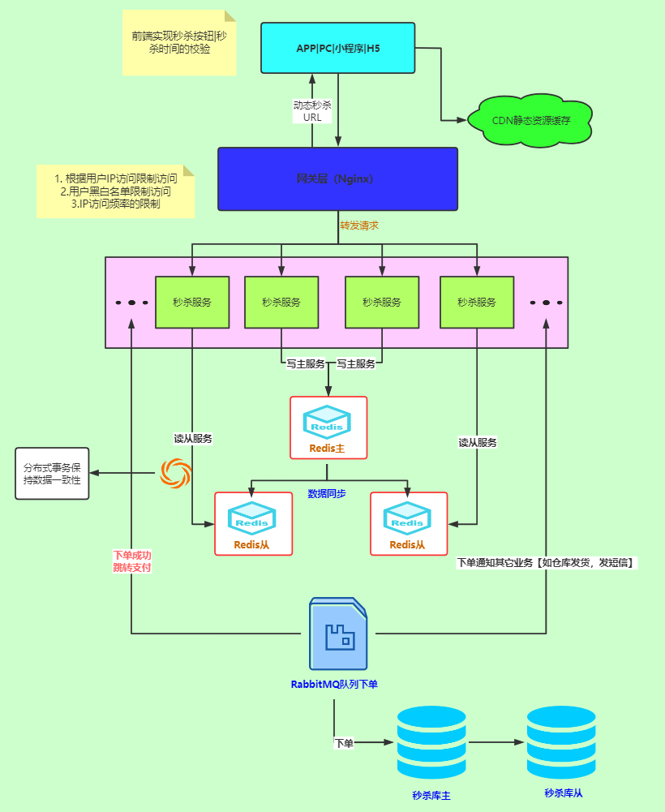

# 秒杀系统设计

## 架构图

## 设计

#### 限流

前端秒杀按钮点击时间间隔进行限制，或弹出等待中页面进行削峰处理。

#### 访问限制

对用户ip进行访问次数限制，对黑名单进行访问限制。

#### 负载均衡

将请求分配到不同的服务器上来进行处理，减少单点压力

#### 多级存储

将秒杀数据从数据库提前读到缓存中，请求直接从缓存读取库存，库存发生变化先写入缓存再写入数据库，注意需要保持分布式事物的一致性。

#### 服务降级

秒杀成功后通过MQ队列下单，下单成功直接返回结果，其他服务下单通知等异步处理。